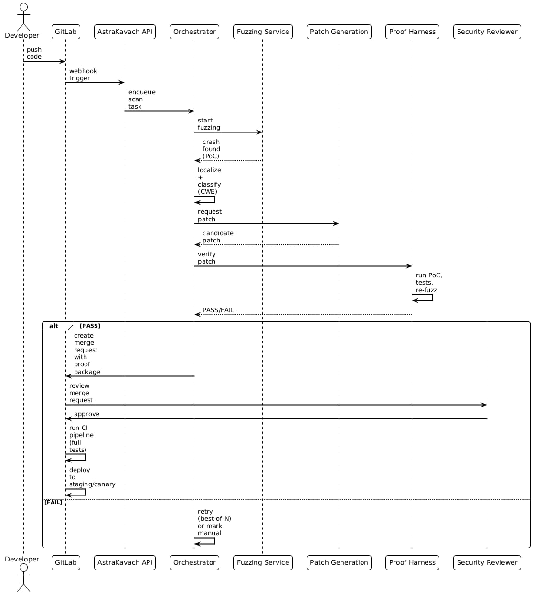

# AstraKavach
Architecture and conceptual framework for ASTRAKAVACH: Autonomous Find-Patch-Prove for Indian Defence Software.

**Overview**
A closed-loop cyber-reasoning system combining fuzzing, static/dynamic analysis, deterministic patching, and an offline LLM as a controlled patch assistant. 

**Core Methodology**
Traditional-first, LLM-last: a closed loop that proves itself.
1. **Discover:** Find reproducible failures using tools like AFL++ and Atheris.
2. **Localize:** Turn failure into a repair target using ASan and Clang SA.
3. **Patch:** Attempt deterministic repair using CWE templates before utilizing an offline Qwen LLM.
4. **Prove:** Verify the fix holds using PoC Replay, pytest, and a 60s Re-fuzz.

**Mandated Stack**
* **Fuzzing:** AFL++, Atheris, ASan/UBSan
* **Static Analysis:** Clang SA, Bandit, Semgrep, Joern
* **LLM:** Quantized Qwen (Offline Inference)

## Architecture

## Execution Workflow

## Research & References
The ASTRAKAVACH framework builds upon established research in automated vulnerability detection, fuzzing, and large language models:

* **Fuzzing Engines:** 
  * [AFL++](https://github.com/AFLplusplus/AFLplusplus): Advanced coverage-guided fuzzing.
  * [Atheris](https://github.com/google/atheris): Coverage-guided Python fuzzing engine.
* **Memory Error Detectors:** 
  * [ASan (AddressSanitizer) & UBSan](https://github.com/google/sanitizers): Fast memory error detectors.
* **Static Analysis:** 
  * [Clang Static Analyzer](https://clang-analyzer.llvm.org/), [Bandit](https://github.com/PyCQA/bandit), [Semgrep](https://semgrep.dev/), and [Joern](https://joern.io/) for finding bugs before execution.
* **Vulnerability Classification:** 
  * Common Weakness Enumeration (CWE) and MITRE ATT&CK frameworks for mapping and templates.
* **Offline LLM Inference:** 
  * [Qwen](https://github.com/QwenLM/Qwen): Used as a quantized, offline model for secure, air-gapped candidate patch generation.
